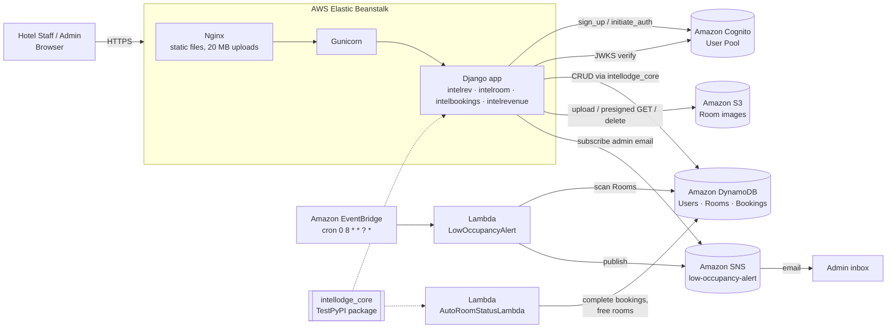

# IntelLodge — Cloud-Native Hotel Management Platform on AWS

IntelLodge is a hotel management web application built with **Django** and deployed on **AWS Elastic Beanstalk**. It handles staff authentication, room inventory, guest bookings and revenue analytics, and runs scheduled background jobs that keep room status up to date and alert administrators when occupancy drops.

The project was built to practise **programmatic use of AWS services with `boto3`**. Every AWS resource the app depends on (Cognito user pool, DynamoDB tables, S3 bucket, SNS topics, Lambda functions and EventBridge rules) is provisioned from Python scripts in this repository, not created by hand in the console.

It also consumes **[`intellodge_core`](https://github.com/OmkarJakulwar/Intellodge_Python_Library)**, a reusable Python library I wrote and published to TestPyPI. It provides a generic DynamoDB CRUD service, logging, exceptions and datetime helpers that are shared by the web app and the Lambda functions.

---

## Table of Contents

- [Features](#features)
- [Architecture](#architecture)
- [AWS Services Used](#aws-services-used)
- [Custom Library: `intellodge_core`](#custom-library-intellodge_core)
- [Project Structure](#project-structure)
- [Data Model (DynamoDB)](#data-model-dynamodb)
- [Application Routes](#application-routes)
- [Getting Started](#getting-started)
- [Provisioning AWS Resources](#provisioning-aws-resources)
- [Deploying to Elastic Beanstalk](#deploying-to-elastic-beanstalk)
- [Serverless Jobs](#serverless-jobs)
- [Security Notes & Known Limitations](#security-notes--known-limitations)
- [Roadmap](#roadmap)

---

## Features

| Module | Django app | What it does |
|---|---|---|
| **Authentication & RBAC** | `intelrev` | Sign-up and login through **Amazon Cognito**. ID tokens are verified against Cognito's JWKS (RS256, audience and issuer checks). User profiles are stored in DynamoDB. Access is role-based (`admin` / `staff`) using custom decorators. |
| **Room management** | `intelroom` | CRUD for rooms (type, price, status). Room images are uploaded to a **private S3 bucket** and served through short-lived **pre-signed URLs**. Deleting a room also deletes its image. |
| **Booking management** | `intelbookings` | Create, view and cancel bookings. The room is validated as vacant before booking, marked **Occupied** when booked and set back to **Vacant** on cancellation. Each booking gets a UUID plus a readable booking code (`BK-YYYYMMDD-####`). |
| **Revenue analytics** | `intelrevenue` | Dashboard showing total revenue, active bookings, occupancy rate, and monthly and yearly revenue charts (Chart.js). |
| **Automated alerts** | `intelrevenue` | A daily **EventBridge** schedule triggers a **Lambda** that calculates occupancy and publishes a low-occupancy email alert through **SNS**. Admins are subscribed to the topic automatically when they register. |
| **Automated housekeeping** | `intelroom` | A **Lambda** completes bookings whose checkout date has passed and releases their rooms back to *Vacant*. |

---

## Architecture



**Request flow (login example)**

1. The user submits credentials, and `CognitoService.sign_in()` calls `initiate_auth` using `USER_PASSWORD_AUTH`.
2. The returned ID token is verified in `verify_cognito_token()`. The code fetches the JWKS, matches the `kid`, and decodes the token with RS256 while checking `aud` and `iss`.
3. The Cognito `sub` claim is used to load the profile from the DynamoDB `Users` table.
4. Username, email and role are stored in a signed-cookie session, and the `@login_required_custom` and `@role_required` decorators check them on every view.

---

## AWS Services Used

| Service | Purpose in IntelLodge | Where in code |
|---|---|---|
| **Amazon Cognito** | User pool with a strong password policy, app client with `USER_PASSWORD_AUTH` and refresh tokens, sign-up, admin confirmation, sign-in, and JWT verification | `intelrev/services/cognito_setup.py`, `cognito_service.py`, `utility_cognito_jwt_token.py` |
| **Amazon DynamoDB** | Primary datastore with three on-demand (`PAY_PER_REQUEST`) tables: `Users`, `Rooms` and `Bookings` | `intelrev/services/dynamodb_setup.py`, `*/models/dynamo_*.py` |
| **Amazon S3** | Private storage for room images, with content-type-aware uploads, listing, deletion and pre-signed GET URLs (1-hour expiry) | `intelrev/services/s3_create_bucket.py`, `s3_setup.py`, `intelroom/views.py` |
| **AWS Lambda** | Two serverless jobs, **LowOccupancyAlert** (Python 3.11) and **AutoRoomStatusLambda** (Python 3.9), each packaged and deployed by a script that creates the function or updates it if it already exists | `intelrevenue/lambda_service/…`, `intelroom/services/lambda_deploy.py` |
| **Amazon EventBridge** | Cron rule (`cron(0 8 * * ? *)`, daily at 08:00 UTC) targeting the alert Lambda, with the `lambda:InvokeFunction` permission granted programmatically | `intelrevenue/services/create_eventbridge_rule.py` |
| **Amazon SNS** | `low-occupancy-alert` and `revenue-drop-alert` topics. Admin emails are subscribed automatically on registration, and a flag stored in DynamoDB prevents duplicate subscriptions | `intelrevenue/services/sns_*.py` |
| **AWS Elastic Beanstalk** | Hosts the Django app (Gunicorn behind Nginx). Uses custom Nginx config for static files and a 20 MB upload limit | `Procfile`, `.platform/nginx/`, `.ebextensions/` |
| **AWS IAM** | Lambdas run under an existing execution role. The EventBridge-to-Lambda invoke permission is added through the API | `lambda_deploy.py`, `create_eventbridge_rule.py` |
| **AWS Cloud9** | Development IDE (it is listed in `CSRF_TRUSTED_ORIGINS`) | `intellodge/settings.py` |

---

## Custom Library: `intellodge_core`

To avoid repeating boto3 boilerplate in every module, I pulled the shared logic into a separate package:

- **Source:** [`Intellodge_Python_Library`](https://github.com/OmkarJakulwar/Intellodge_Python_Library)
- **Published to:** TestPyPI (`intellodge_core==1.0.3`)

```bash
pip install --index-url https://test.pypi.org/simple \
            --extra-index-url https://pypi.org/simple \
            intellodge_core==1.0.3
```

| Module | Provides | Used by |
|---|---|---|
| `base_service.BaseDynamoDBService` | Generic `create` / `read` / `update` / `delete` / `find_all` for any DynamoDB table. It builds `UpdateExpression`s dynamically from a dict and returns consistent `{success, ...}` results | `Room`, `BookingService`, `DynamoUserProfile`, `RevenueService`, `AutoRoomStatusLambda` |
| `logger.get_logger` | A consistently formatted logger for all modules | Every module |
| `exceptions` | `NotFoundError`, `ValidationError`, `PermissionDenied`, `ServiceError` | Bookings, user profile |
| `datetime_utils` | `now_utc()`, `format_date()`, `parse_date()` | Audit timestamps (`created_at`) |
| `validators`, `response_utils`, `auth_utils` | Field and email validation, standard API response shapes, session helpers | Available for reuse |

**Example.** A domain model is a thin subclass of the base service:

```python
from intellodge_core.base_service import BaseDynamoDBService

class BookingService(BaseDynamoDBService):
    def __init__(self):
        super().__init__("Bookings")   # table name, and that's it

    def cancel_booking(self, booking_id):
        booking = self.get_booking(booking_id)
        roomService.update(booking["room_number"], status="Vacant")
        self.update({"booking_id": booking_id}, {"status": "cancelled"})
```

The same package is bundled into the `AutoRoomStatusLambda` deployment zip through `requirements_lambda.txt`, so the Lambda and the web app use the same data-access code.

---

## Project Structure

```
Intellodge_Cloud_Platform_Programming/
├── intellodge/                 # Django project: settings, root URLs, WSGI/ASGI
├── intelrev/                   # Auth, dashboard, RBAC decorators, AWS setup scripts
│   ├── services/
│   │   ├── cognito_setup.py            # Creates the Cognito user pool and app client
│   │   ├── cognito_service.py          # sign_up / admin_confirm_sign_up / sign_in
│   │   ├── utility_cognito_jwt_token.py# JWKS-based ID token verification
│   │   ├── dynamodb_setup.py           # Creates the Users, Rooms and Bookings tables
│   │   ├── s3_create_bucket.py         # Creates the room-image bucket
│   │   └── s3_setup.py                 # Upload, list and delete helpers
│   ├── models/dynamo_user_profile.py
│   └── decorators.py                   # @login_required_custom, @role_required
├── intelroom/                  # Room CRUD + S3 images
│   ├── models/dynamo_rooms.py
│   └── services/
│       ├── lambda_code/auto_room_status.py   # Lambda handler
│       └── lambda_deploy.py                  # Build zip (with deps) and deploy
├── intelbookings/              # Booking lifecycle
│   └── models/dynamo_bookings.py
├── intelrevenue/               # Analytics + alerting
│   ├── services/
│   │   ├── revenue_services.py         # Revenue and occupancy aggregations
│   │   ├── sns_create_topic.py / sns_subscription.py / sns_alerts.py
│   │   └── create_eventbridge_rule.py
│   └── lambda_service/low_occupancy_alert/
│       ├── lambda_function.py
│       └── lambda_deploy.py
├── .platform/nginx/            # Elastic Beanstalk Nginx overrides
├── .ebextensions/              # Elastic Beanstalk config
├── Procfile                    # gunicorn intellodge.wsgi:application
└── requirements.txt
```

---

## Data Model (DynamoDB)

All tables use on-demand capacity.

| Table | Partition key | Main attributes |
|---|---|---|
| `Users` | `cognito_sub` (S) | username, firstname, lastname, gender, email, role, sns_subscribed, created_at |
| `Rooms` | `room_number` (S) | room_type (Single/Double/Deluxe/Suite), price (Decimal), status (Vacant/Occupied/Under Maintenance) |
| `Bookings` | `booking_id` (S, UUID) | booking_code, room_number, guest_name, guest_email, amount, check_in_date, check_out_date, status, created_at |

S3 image key convention: `s3://<bucket>/<room_type>/<room_number>.jpg`

---

## Application Routes

| Path | View | Access |
|---|---|---|
| `/` | Redirects to the dashboard or the login page | Public |
| `/register/`, `/login/`, `/logout/` | Cognito auth | Public |
| `/dashboard/` | KPIs: rooms, occupancy, revenue, bookings | Logged in |
| `/rooms/` | Room list with pre-signed image URLs | admin, staff |
| `/rooms/add/`, `/rooms/delete/<room>/` | Create or delete a room and its image | admin |
| `/rooms/edit/<room>/` | Update a room and optionally replace its image | admin, staff |
| `/bookings/`, `/bookings/create/`, `/bookings/<id>/`, `/bookings/cancel/<id>/` | Booking lifecycle | admin, staff |
| `/revenue/` | Revenue analytics dashboard | Logged in |

---

## Getting Started

### Prerequisites

- Python 3.9+
- An AWS account (or AWS Academy Learner Lab) with credentials configured (`aws configure` or an instance role)
- AWS CLI and EB CLI (`awsebcli` is included in `requirements.txt`)

### Local setup

```bash
git clone https://github.com/OmkarJakulwar/Intellodge_Cloud_Platform_Programming.git
cd Intellodge_Cloud_Platform_Programming

python3 -m venv venv && source venv/bin/activate
pip install -r requirements.txt   # also pulls intellodge_core from TestPyPI

python manage.py collectstatic --noinput
python manage.py runserver 0.0.0.0:8000
```

Update the values in `intellodge/settings.py` to match your own AWS resources:

```python
COGNITO_USER_POOL_ID = "<your-pool-id>"
COGNITO_CLIENT_ID    = "<your-app-client-id>"
COGNITO_REGION       = "us-east-1"
AWS_S3_BUCKET        = "<your-bucket-name>"
```

---

## Provisioning AWS Resources

Run these scripts once, in this order. They are idempotent where AWS allows it.

```bash
python intelrev/services/cognito_setup.py          # prints the pool ID and client ID
python intelrev/services/dynamodb_setup.py         # creates Users, Rooms and Bookings
python intelrev/services/s3_create_bucket.py       # creates the image bucket
python intelrevenue/services/sns_create_topic.py   # creates the SNS topics

# Lambdas
python intelroom/services/lambda_deploy.py         # builds and deploys AutoRoomStatusLambda
(cd intelrevenue/lambda_service/low_occupancy_alert && python lambda_deploy.py)

# Schedule
python intelrevenue/services/create_eventbridge_rule.py
```

---

## Deploying to Elastic Beanstalk

```bash
eb init -p python-3.9 intellodge --region us-east-1
eb create intellodge-env
eb deploy
```

- The `Procfile` starts `gunicorn intellodge.wsgi:application --bind 0.0.0.0:8000`.
- `.platform/nginx/conf.d/elasticbeanstalk/static.conf` serves `/static` from `staticfiles/` with a 30-day cache.
- `client_max_body_size 20M` allows room-image uploads.

---

## Serverless Jobs

### LowOccupancyAlert (EventBridge → Lambda → SNS)
- Triggered daily at 08:00 UTC.
- Scans `Rooms`, computes occupancy, and publishes an email alert to `low-occupancy-alert` when occupancy is **below 30%**.
- The table name and topic ARN can be set through the `ROOMS_TABLE` and `SNS_TOPIC_ARN` environment variables.

### AutoRoomStatusLambda
- Finds bookings whose `check_out_date` is today or earlier and that are not already *Cancelled* or *Completed*.
- Marks each booking **Completed** and sets its room to **Vacant**.
- It is built with `lambda_deploy.py`, which pip-installs dependencies (including `intellodge_core`) into `lambda_build/`, zips them, and then calls `create_function` or `update_function_code`.

---

## Security Notes & Known Limitations

This is an academic project, and some shortcuts were taken to fit the AWS Academy Learner Lab environment:

- Resource IDs (Cognito pool and client, account-specific ARNs, `LabRole`) and the Django `SECRET_KEY` are hard-coded. In production they belong in environment variables, **AWS Secrets Manager** or **SSM Parameter Store**.
- `ALLOWED_HOSTS = ['*']` should be restricted to the Elastic Beanstalk domain.
- `BaseDynamoDBService.find_all()` uses a single `scan()` without pagination, which is fine for a demo but needs `LastEvaluatedKey` handling or GSIs at scale.
- The booking and room-status updates are two separate writes. A DynamoDB `TransactWriteItems` call would make them atomic.
- Automated tests have not been written yet.

---

## Roadmap

- [ ] Infrastructure as Code (AWS CDK / CloudFormation / Terraform) to replace the setup scripts
- [ ] Move secrets and config to environment variables and Secrets Manager
- [ ] CI/CD with GitHub Actions or CodePipeline for Elastic Beanstalk and Lambda
- [ ] CloudWatch dashboards and alarms, plus structured logging
- [ ] Guest-facing booking portal and email confirmations via SES
- [ ] Unit tests with `moto` for AWS mocking

---

## Author

**Omkar Jakulwar** · Cloud Platform Programming project
